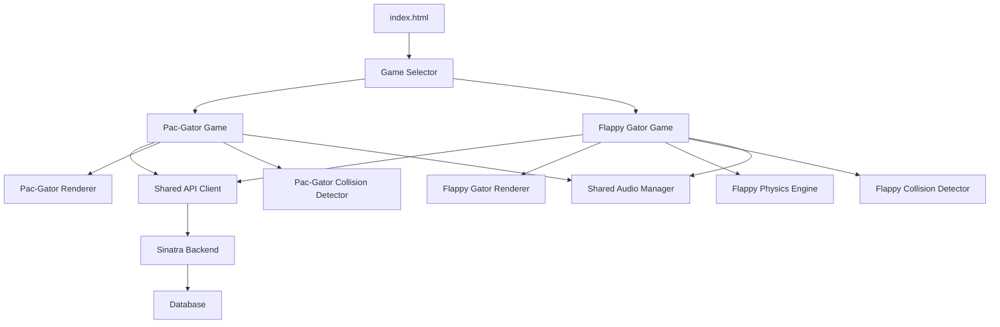
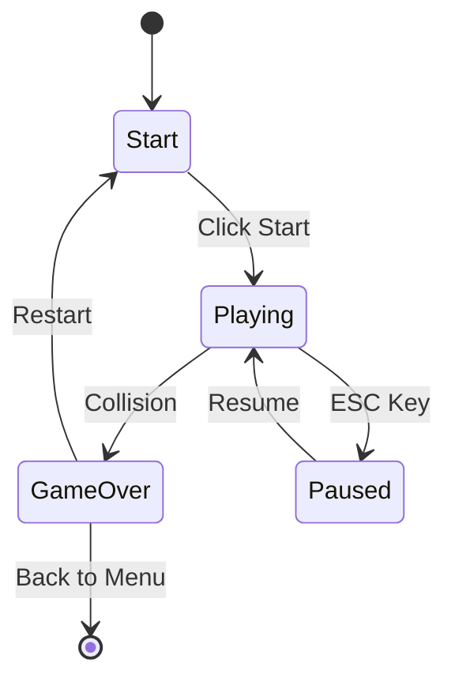

# Design Document: Flappy Gator Game

## Overview

The Flappy Gator game is an endless side-scrolling game that will be integrated into the existing minigame system alongside Pac-Gator. The game features gravity-based physics where a winged gator character must navigate through gaps in procedurally generated pipe obstacles. The player controls the gator by clicking, tapping, or pressing spacebar to apply upward velocity, fighting against constant downward gravity.

The implementation will reorganize the existing codebase to support multiple games through a modular architecture, with game-specific code separated into dedicated directories and shared utilities extracted into common modules. The game will integrate with the existing Sinatra backend API for high score tracking and will be fully responsive for mobile devices.

## Architecture

### System Structure

```
project-root/
├── app.rb                          # Sinatra backend (unchanged)
├── public/
│   ├── index.html                  # Main entry point with game selector
│   ├── shared/
│   │   ├── game-selector.js        # Game selection UI logic
│   │   ├── api-client.js           # Shared API communication
│   │   ├── audio-manager.js        # Shared audio playback utilities
│   │   └── shared-styles.css       # Common styling
│   ├── pac-gator/
│   │   ├── pac-gator.html          # Pac-Gator game container
│   │   ├── game.js                 # Pac-Gator game logic (moved from public/game.js)
│   │   ├── pac-gator-renderer.js   # Pac-Gator specific rendering (wheel character)
│   │   ├── particles.js            # Pac-Gator particles (moved)
│   │   ├── background-music.js     # Pac-Gator music (moved)
│   │   └── style.css               # Pac-Gator styles (moved)
│   └── flappy-gator/
│       ├── flappy-gator.html       # Flappy Gator game container
│       ├── game.js                 # Flappy Gator game logic
│       ├── flappy-gator-renderer.js # Flappy Gator specific rendering (winged character)
│       ├── physics-engine.js       # Gravity-based physics (Flappy-specific)
│       └── style.css               # Flappy Gator styles
└── assets/
    ├── pac-gator/                  # Pac-Gator specific assets
    │   └── (existing sounds)
    └── flappy-gator/               # Flappy Gator specific assets
        └── flap.wav                # Flap sound effect
```

### Component Interaction Flow



### Shared vs Game-Specific Components

**Shared Components** (used by both games):
- **API Client**: Both games submit scores and retrieve high scores from the same backend
- **Audio Manager**: Common audio playback utilities for sound effects and music
- **Game Selector**: Manages switching between games

**Game-Specific Components** (unique to each game):
- **Renderers**: Pac-Gator uses a wheel-based character renderer, Flappy Gator uses a winged character renderer
- **Physics**: Pac-Gator uses grid-based movement, Flappy Gator uses gravity-based physics
- **Collision Detection**: Pac-Gator detects maze wall collisions, Flappy Gator detects pipe and boundary collisions
- **Game Logic**: Completely different gameplay mechanics

This separation ensures each game can have its own unique mechanics while sharing infrastructure code for common functionality like API communication and audio management.

## Components and Interfaces

### 1. Game Selector Component

**Responsibility:** Manages game selection and navigation between games.

**Interface:**
```javascript
class GameSelector {
  constructor(containerElement)
  showSelector()
  hideSelector()
  loadGame(gameName)
  getCurrentGame()
}
```

**Key Methods:**
- `showSelector()`: Displays the game selection menu
- `loadGame(gameName)`: Loads the specified game's HTML and JavaScript
- `hideSelector()`: Hides the selector when a game is active

### 2. Audio Manager (Shared)

**Responsibility:** Manages audio playback for both games with volume control and muting.

**Interface:**
```javascript
class AudioManager {
  constructor()
  loadSound(name, url)
  playSound(name, volume = 1.0)
  stopSound(name)
  setMuted(isMuted)
  isMuted()
}
```

**Key Methods:**
- `loadSound(name, url)`: Preloads an audio file
- `playSound(name, volume)`: Plays a loaded sound effect
- `setMuted(isMuted)`: Enables/disables all audio

### 3. Flappy Gator Game Engine

**Responsibility:** Core game loop, state management, and coordination of all game systems.

**Interface:**
```javascript
class FlappyGatorGame {
  constructor(canvasElement)
  init()
  start()
  pause()
  restart()
  gameLoop()
  handleInput(inputType)
  updatePhysics()
  checkCollisions()
  updateScore()
  gameOver()
}
```

**State Machine:**


### 4. Flappy Gator Character Renderer

**Responsibility:** Renders the winged gator character with animations.

**Interface:**
```javascript
class GatorRenderer {
  constructor(ctx)
  drawGator(x, y, rotation, isFlapping)
  animateWings(frameCount)
  drawBody(x, y, rotation)
  drawWings(x, y, wingAngle)
  drawEyes(x, y)
}
```

**Character Design:**
- Body: Green (#5CB54D) rounded rectangle with gator texture
- Wings: Two triangular wings that flap up/down
- Eyes: Two white circles with black pupils
- Size: Approximately 40x30 pixels
- Wing animation: 10-frame cycle alternating between up and down positions

### 5. Physics Engine (Flappy-Specific)

**Responsibility:** Manages gravity, velocity, and position updates.

**Interface:**
```javascript
class PhysicsEngine {
  constructor(gravity, flapStrength)
  applyGravity(entity)
  applyFlap(entity)
  updatePosition(entity, deltaTime)
  getVelocity(entity)
  setVelocity(entity, velocity)
}
```

**Physics Constants:**
- Gravity: 0.6 pixels/frame²
- Flap strength: -10 pixels/frame
- Terminal velocity: 12 pixels/frame
- Rotation factor: velocity * 3 degrees (clamped to ±45°)

### 6. Pipe Generator

**Responsibility:** Creates and manages pipe obstacles.

**Interface:**
```javascript
class PipeGenerator {
  constructor(canvasWidth, canvasHeight)
  generatePipe()
  updatePipes(scrollSpeed)
  removePipe(pipe)
  getPipes()
  reset()
}
```

**Pipe Specifications:**
- Width: 60 pixels
- Gap height: 150 pixels
- Minimum gap position: 100 pixels from top
- Maximum gap position: canvasHeight - 250 pixels
- Spawn interval: 120 frames (2 seconds at 60 FPS)
- Scroll speed: 2 pixels/frame
- Color: Kiro green (#5CB54D)

### 7. Collision Detector (Flappy-Specific)

**Responsibility:** Detects collisions between gator and pipes/boundaries.

**Interface:**
```javascript
class CollisionDetector {
  constructor(gatorBounds, canvasHeight)
  checkPipeCollision(gatorX, gatorY, pipes)
  checkBoundaryCollision(gatorY)
  isPointInRect(px, py, rect)
  getGatorHitbox(gatorX, gatorY)
}
```

**Collision Detection:**
- Gator hitbox: Circular approximation with radius 15 pixels
- Pipe hitbox: Rectangular (top and bottom sections)
- Boundary check: Y position < 0 or Y position > canvasHeight - gatorHeight

### 8. API Client (Shared)

**Responsibility:** Communicates with backend for high scores.

**Interface:**
```javascript
class APIClient {
  constructor(baseURL)
  async getHighScores(gameType)
  async submitScore(gameType, playerName, score)
  async getHistory(gameType)
}
```

**Game Type Identifiers:**
- "pac-gator" for Pac-Gator scores
- "flappy-gator" for Flappy Gator scores

## Data Models

### Gator Entity
```javascript
{
  x: number,              // X position (fixed at 100px from left)
  y: number,              // Y position (starts at canvasHeight / 2)
  velocity: number,       // Vertical velocity in pixels/frame
  rotation: number,       // Rotation angle in degrees
  width: number,          // 40 pixels
  height: number,         // 30 pixels
  isFlapping: boolean     // True during flap animation
}
```

### Pipe Entity
```javascript
{
  x: number,              // X position
  width: number,          // 60 pixels
  gapY: number,           // Y position of gap center
  gapHeight: number,      // 150 pixels
  scored: boolean,        // True if player has passed this pipe
  topHeight: number,      // Height of top pipe section
  bottomY: number         // Y position of bottom pipe section
}
```

### Game State
```javascript
{
  state: string,          // "start" | "playing" | "paused" | "gameOver"
  score: number,          // Current score
  highScore: number,      // High score from API
  frameCount: number,     // Frame counter for animations
  pipes: Pipe[],          // Array of active pipes
  gator: Gator            // Gator entity
}
```

## Correctness Properties

*A property is a characteristic or behavior that should hold true across all valid executions of a system-essentially, a formal statement about what the system should do. Properties serve as the bridge between human-readable specifications and machine-verifiable correctness guarantees.*


### Property Reflection

After analyzing all acceptance criteria, the following redundancies were identified and consolidated:
- Properties 2.1 and 2.4 (click/tap and spacebar input) → Combined into single input handling property
- Properties 3.4 and 6.3 (pipe color) → Duplicate, kept only one
- Properties 4.2 and 4.3 (top/bottom boundary) → Combined into boundary collision property
- Properties 7.2, 7.3, 7.4, 7.5 (restart behaviors) → Combined into comprehensive restart property
- Properties 11.2 and 11.3 (wing animation states) → Combined into wing animation property

### Correctness Properties

Property 1: Game selection loads correct game
*For any* game selection (Pac-Gator or Flappy Gator), clicking the game option should load that game's JavaScript and hide the game selector
**Validates: Requirements 1.2**

Property 2: High score data isolation
*For any* sequence of game switches between Pac-Gator and Flappy Gator, each game's high score data should remain unchanged and independent
**Validates: Requirements 1.4**

Property 3: Input applies upward velocity
*For any* valid input event (click, tap, or spacebar) during the playing state, the gator's velocity should become negative (upward)
**Validates: Requirements 2.1, 2.4**

Property 4: Gravity continuously applied
*For any* frame during the playing state without input, the gator's velocity should decrease by the gravity constant
**Validates: Requirements 2.2**

Property 5: Non-playing states ignore input
*For any* game state that is not "playing" (start, paused, gameOver), input events should not modify the gator's velocity
**Validates: Requirements 2.3**

Property 6: Pipes generated at intervals
*For any* game session, after every spawn interval (120 frames), a new pipe should be added to the pipes array
**Validates: Requirements 3.1**

Property 7: Off-screen pipes removed and regenerated
*For any* pipe whose X position is less than -pipeWidth, that pipe should be removed from the pipes array and a new pipe should be generated
**Validates: Requirements 3.2**

Property 8: Pipe gaps within safe boundaries
*For any* generated pipe, the gap Y position should be greater than or equal to minGapY and less than or equal to maxGapY
**Validates: Requirements 3.3**

Property 9: Pipes use brand color
*For any* rendered pipe, the fill color should be #5CB54D (Kiro brand green)
**Validates: Requirements 3.4**

Property 10: Pipes scroll at constant speed
*For any* frame during the playing state, all pipes' X positions should decrease by the scroll speed constant
**Validates: Requirements 3.5**

Property 11: Pipe collision triggers game over
*For any* gator position that intersects with a pipe's hitbox, the game state should transition to "gameOver"
**Validates: Requirements 4.1**

Property 12: Boundary collision triggers game over
*For any* gator Y position that is less than 0 or greater than canvasHeight - gatorHeight, the game state should transition to "gameOver"
**Validates: Requirements 4.2, 4.3**

Property 13: Collision stops game updates
*For any* collision detection that triggers game over, the game loop should stop updating physics and pipe positions
**Validates: Requirements 4.4**

Property 14: Passing pipe increments score
*For any* pipe where the gator's X position exceeds the pipe's X position + pipeWidth and the pipe has not been scored, the score should increment by 1 and the pipe should be marked as scored
**Validates: Requirements 5.1**

Property 15: Score display synchronization
*For any* score value change, the displayed score in the UI should match the internal score value
**Validates: Requirements 5.2**

Property 16: Game over displays final score
*For any* game over state, the displayed final score should equal the score value at the time of game over
**Validates: Requirements 5.3**

Property 17: Game over submits score to API
*For any* game over state, an API call should be made to submit the final score with game type "flappy-gator"
**Validates: Requirements 5.4**

Property 18: Game over displays high score
*For any* game over screen display, the high score shown should match the value retrieved from the Score API for "flappy-gator"
**Validates: Requirements 5.5**

Property 19: Flap animates rotation
*For any* flap input, the gator's rotation should change proportionally to the velocity
**Validates: Requirements 6.4**

Property 20: Restart resets game state
*For any* restart action, the score should be 0, the gator position should be at starting coordinates, all pipes should be cleared and regenerated, and the game state should be "playing"
**Validates: Requirements 7.2, 7.3, 7.4, 7.5**

Property 21: Start button transitions to playing
*For any* start button click from the start screen, the game state should transition to "playing"
**Validates: Requirements 8.3**

Property 22: Canvas scales to mobile viewport
*For any* mobile viewport width, the canvas width should scale to fit the screen width while maintaining aspect ratio
**Validates: Requirements 9.1**

Property 23: Touch input registers as flap
*For any* touch event on the canvas during the playing state, the gator's velocity should become negative (upward)
**Validates: Requirements 9.2**

Property 24: Viewport changes scale proportionally
*For any* viewport resize event, the canvas dimensions should scale proportionally to maintain the original aspect ratio
**Validates: Requirements 9.3**

Property 25: Mobile rendering maintains aspect ratio
*For any* game element rendered on mobile, the width-to-height ratio should match the desktop ratio
**Validates: Requirements 9.4**

Property 26: Dynamic game loading
*For any* game selection, the Game System should load only the JavaScript files specific to that game
**Validates: Requirements 10.4**

Property 27: Gator renders with wings
*For any* gator render call, the rendered output should include wing elements
**Validates: Requirements 11.1**

Property 28: Wing animation reflects state
*For any* gator render, if flapping is true, wings should be in up position; if flapping is false, wings should be in resting position
**Validates: Requirements 11.2, 11.3**

Property 29: Character uses brand colors
*For any* gator render, the body and wing colors should use values from the Kiro brand color palette
**Validates: Requirements 11.4**

## Error Handling

### Input Validation
- **Invalid API responses**: If the Score API returns an error or invalid data, display cached high scores or default to 0
- **Network failures**: Implement retry logic with exponential backoff for API calls
- **Malformed score data**: Validate that scores are non-negative integers before submission

### Game State Errors
- **Invalid state transitions**: Log errors and reset to start screen if an invalid state transition is attempted
- **Canvas context loss**: Detect context loss and attempt to restore, or display error message to user
- **Animation frame errors**: Catch errors in game loop and attempt to restart, or transition to error state

### Collision Detection Edge Cases
- **Simultaneous collisions**: If multiple collision types occur in the same frame, prioritize pipe collision over boundary collision
- **Floating point precision**: Use integer pixel positions where possible to avoid floating point comparison issues
- **Hitbox overlap**: Ensure hitboxes are slightly smaller than visual elements to provide forgiving gameplay

### Mobile-Specific Errors
- **Touch event conflicts**: Prevent default touch behaviors to avoid scrolling during gameplay
- **Orientation changes**: Pause game during orientation change and resize canvas appropriately
- **Performance degradation**: Monitor frame rate and reduce particle effects if FPS drops below 30

## Testing Strategy

### Unit Testing Framework
We will use **Jest** as the testing framework for JavaScript unit tests and property-based tests. Jest provides built-in mocking capabilities, assertion libraries, and good integration with modern JavaScript projects.

### Property-Based Testing Framework
We will use **fast-check** as the property-based testing library. Fast-check is a mature JavaScript library that provides powerful generators and shrinking capabilities for property-based testing.

### Testing Configuration
- Minimum 100 iterations per property-based test
- Each property-based test must include a comment tag: `**Feature: flappy-gator-game, Property {number}: {property_text}**`
- Tests should run in Node.js environment with jsdom for DOM simulation

### Unit Testing Approach

Unit tests will cover:

**Example 1: Start screen UI elements**
- Verify start screen displays game title
- Verify start screen shows start button
- Verify start screen displays high score
- Verify start screen shows gator preview

**Example 2: Game selector UI**
- Verify game selector displays both game options on load
- Verify back button exists when game is active

**Example 3: Restart button visibility**
- Verify restart button is present on game over screen

**Example 4: Background color**
- Verify canvas background is rendered with #87CEEB

**Integration Testing:**
- Test complete game flow from start to game over
- Test game switching between Pac-Gator and Flappy Gator
- Test API integration for score submission and retrieval

### Property-Based Testing Approach

Property-based tests will verify universal behaviors across all inputs:

**Generators needed:**
- `gameStateGen`: Generates valid game states (start, playing, paused, gameOver)
- `gatorGen`: Generates gator entities with random positions and velocities
- `pipeGen`: Generates pipe entities with random positions and gap heights
- `inputEventGen`: Generates input events (click, tap, spacebar)
- `viewportSizeGen`: Generates viewport dimensions for responsive testing

**Key properties to test:**
- Physics properties (gravity, flap velocity)
- Collision detection across all positions
- Score increment logic for all pipe passages
- State transitions for all input combinations
- Responsive scaling for all viewport sizes
- Pipe generation boundaries for all random values

**Shrinking strategy:**
- When a property fails, fast-check will automatically shrink the failing input to the minimal counterexample
- This helps identify the exact boundary conditions that cause failures

### Test Organization

```
tests/
├── unit/
│   ├── game-selector.test.js
│   ├── gator-renderer.test.js
│   ├── physics-engine.test.js
│   ├── pipe-generator.test.js
│   ├── collision-detector.test.js
│   └── api-client.test.js
├── property/
│   ├── physics.property.test.js
│   ├── collision.property.test.js
│   ├── scoring.property.test.js
│   ├── state-transitions.property.test.js
│   └── responsive.property.test.js
└── integration/
    ├── game-flow.test.js
    └── game-switching.test.js
```

### Testing Edge Cases

Property-based testing will naturally cover edge cases through random generation, but we should ensure generators include:
- Boundary Y positions (0, canvasHeight)
- Minimum and maximum gap positions
- Zero velocity
- Maximum velocity
- Empty pipes array
- Single pipe in array
- Viewport dimensions at mobile breakpoints

### Mocking Strategy

- Mock Canvas 2D context for rendering tests
- Mock API calls using Jest mocks
- Mock requestAnimationFrame for controlled frame progression
- Mock audio elements to avoid playback during tests
- Use jsdom for DOM manipulation tests
